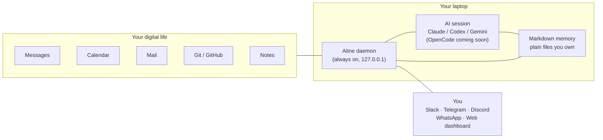

<div align="center">

# Aitne

**A local-first, proactive personal AI agent.**
A long-running TypeScript daemon watches your calendar, mail, repos, and notes — and acts on its own. Your AI of choice (Claude / Codex / Gemini; OpenCode coming soon) is the brain; Aitne is the nervous system.

[](https://www.npmjs.com/package/@aitne-sh/aitne)
[](./LICENSE)
[](https://nodejs.org)
[](#status)
[](#platform-support)

```bash
npm install -g @aitne-sh/aitne@latest
aitne start
```


</div>

---

## Why Aitne

- **Proactive, not reactive.** Drafts your morning plan at 04:00. Surfaces the email you forgot. Nudges you about the PR your teammate is waiting on. You don't have to open an app.
- **Local-first.** Daemon binds to `127.0.0.1` only. Secrets in the OS keychain. Memory in plain Markdown under `~/.personal-agent/`. No telemetry, no cloud state.
- **Multi-backend.** Bring Claude Code, Codex CLI, or Gemini CLI — or all three. Per-task tier routing decides which one runs for each kind of work. (OpenCode is wired internally and ships as preview-only in this release.)
- **Compounds.** Every DM, every correction shapes how Aitne thinks about you. The model doesn't change — the context does.

---

## Highlights

<details>
<summary><b>Time, calendar, travel</b></summary>

- Auto-generate `today.md` every morning with your real schedule
- 15-min approach reminders for every event, with travel time pre-computed via Google Maps
- Find a 30-min slot across multiple calendars — Aitne checks freebusy and replies with options
- Auto-extract flight, hotel, train confirmations from email into a structured travel timeline
</details>

<details>
<summary><b>Mail across every account</b></summary>

- Unified inbox across Gmail, Outlook, Yahoo, and iCloud (OAuth or app-password / IMAP)
- Local FTS5 full-text search across every account
- Auto-classify, label, archive, and draft replies in your style
- Forwarded receipts auto-extract into a structured receipts table
- IMAP IDLE for near-real-time delivery; PDF/image attachments are extracted and indexed
</details>

<details>
<summary><b>Knowledge: Obsidian, Notion, your own wiki</b></summary>

- Use your existing Obsidian vault as Aitne's primary memory store — wiki-links keep working
- Append to your daily note via the official Obsidian CLI
- Full Notion page and database CRUD
- DM `!ingest <url>` to capture a source, `!compile` to synthesize raw notes into linked wiki articles
- `!ask <question>` answers from your own wiki and writes the cited reply to `30_outputs/`
- `!lint`, `!trace`, `!connect` for vault health, idea evolution, cross-domain bridges
- Multiple workspaces (`!ingest @research ...`) — internal or any number of external Obsidian vaults
</details>

<details>
<summary><b>Code, Git, GitHub</b></summary>

- Local Git: `git log`, `git diff`, `git show` exposed via daemon proxy
- GitHub: PR lists, comments, issues, webhook receivers (HMAC-SHA256 verified)
- Per-repo cron triggers — "every Monday at 09:00, summarize merged PRs into `projects/<repo>.md`"
- Auto-detect when a coworker modified a file you're about to ship
- Unified Repositories: one row pairs a local clone with a GitHub remote; the doctor flags drift
</details>

<details>
<summary><b>Self-management via natural language</b></summary>

- "Don't run hourly checks on weekends" — patches the cron window
- "Remember my partner's birthday is March 14" — appends to `user/profile.md`
- "I prefer concise replies — no preamble" — updates the agent's `character` field
- "Email me a summary every Friday at 5pm" — creates a recurring schedule
- "Switch to Codex for code reviews" — flips the per-process backend mapping
- Every change is journaled to `agent_actions` — audit anything via `aitne audit`
</details>

<details>
<summary><b>Bring your own toolkit</b></summary>

- Your `~/.claude/skills`, `~/.codex/config.toml`, and `~/.gemini/` settings are loaded on session init (`~/.opencode/` is recognised but its executor is coming soon)
- Custom MCP servers materialize into every per-session workdir
- Aitne layers its persona on top of your existing config — nothing gets overwritten
- Voice attachments — opt-in local Whisper transcription via `ffmpeg-static` + `@huggingface/transformers`
</details>

---

## Status

Pre-1.0. APIs, schema, and dashboard surfaces may still change. SQLite migrations are deliberately destructive ("clean reinstall, no data migration"); Markdown memory in `context/` is forward-compatible and safe to keep across upgrades.

---

## Install

```bash
npm install -g @aitne-sh/aitne@latest
aitne start
```

Then bring at least one AI backend. The documented operating mode is **provider API keys** — paste them into the setup wizard (they land in the OS keychain, never `.env`):

| Backend | Install | Auth |
|---|---|---|
| **Claude Code** | `npm install -g @anthropic-ai/claude-code` | `ANTHROPIC_API_KEY` in the wizard (Anthropic's headless-agent policy disallows Pro/Max subscriptions for SDK-driven sessions) |
| **OpenAI Codex CLI** | `npm install -g @openai/codex` | `OPENAI_API_KEY` in the wizard, or `codex login --device-auth` as fallback |
| **Google Gemini CLI** | `npm install -g @google/gemini-cli` | `GEMINI_API_KEY` / `GOOGLE_API_KEY`, or OAuth on first use |
| **OpenCode** (sst/opencode) | _coming soon_ — registered for preview; setup will open when the runtime executor lands | _coming soon_ |

The daemon listens on `:8321`, the dashboard on `:3000`. After `aitne start`, the browser opens to a 9-step setup wizard.

### Verify the install

```bash
aitne status   # PIDs, uptime, connected platforms, today's spend
aitne doctor   # 10-check install diagnostic
aitne logs -f  # tail the daemon log
```

### From source

For contributors, or to hack on the daemon directly. Requires Node ≥ 22 and pnpm 10.x.

```bash
git clone https://github.com/Aitne-sh/Aitne.git aitne
cd aitne
corepack enable
pnpm install
pnpm dev          # foreground mode with full stdio
```

See [docs/setup-guide.md](docs/setup-guide.md) for the full installation walkthrough.

---

## How it works

A long-running daemon receives signals from every channel you've connected, parks short-term state in SQLite, and spawns an AI session whenever it needs to think. The session reads your Markdown memory, calls a curated set of skills, and writes results back through the daemon API.



Two execution paths run in parallel:

- **Reactive path** — owner DMs/mentions, cron routines (morning / evening / weekly), calendar approach events. Event → priority heap → dispatcher → backend session.
- **Polling path** — observers for Git, GitHub, Obsidian, Notion, Calendar, Mail write to an `observations` table without spawning sessions. An hourly cron triages those observations through a lite-tier session, then escalates to a full Sonnet-class session only if something worth surfacing was found.

A pre-pass `routine.fetch_window` session runs before each routine, fanning out per-account fetches (mail, calendar, Notion) into the `observations` table so the main session reads from a single source.

---

## CLI

### Lifecycle

| Command | What it does |
|---|---|
| `aitne start [--no-open]` | Build if stale, launch daemon + dashboard in background |
| `aitne stop` | Graceful shutdown (SIGTERM → SIGKILL after 10 s) |
| `aitne restart [--clean-context]` | Stop then start. `--clean-context` wipes `context/` after a tarball backup |
| `aitne status` | PIDs, uptime, platforms, backends, today's spend |
| `aitne logs [-f] [-n N] [-d]` | Tail daemon log (`-d` = dashboard log, `-f` = follow) |
| `aitne dev` | Foreground mode (full stdio) |

### Operations

| Command | What it does |
|---|---|
| `aitne doctor [--json]` | 10 install-health checks + repo-drift expansion |
| `aitne audit [flags]` | Read the agent action log from SQLite — `--since`, `--type`, `--result`, `--backend`, `--detail`, `--json` |
| `aitne setup` | Re-open the dashboard `/setup` wizard |
| `aitne open` | Open the dashboard in your browser |
| `aitne run-now <job>` | Fire a maintenance job on demand (currently `roadmap_maintenance`) |
| `aitne verify <target>` | Read-only post-launch verification of a shipped design surface |
| `aitne version` / `update` / `uninstall` | Self-explanatory |

`aitne help [cmd]` for per-command details.

---

## Backends

Aitne abstracts four AI runtimes behind a single `IAgentCore` interface. Every kind of work has a `ProcessKey` mapped to a tier (`lite` / `medium` / `high`) and a backend; for Claude those tiers map to **Haiku 4.5 / Sonnet 4.6 / Opus 4.7**.

| Backend | Implementation | Resume | Strengths |
|---|---|---|---|
| **Claude Code** | `@anthropic-ai/claude-agent-sdk` | ✓ | Best for routines, deep context, server-side advisor |
| **Codex CLI** | OpenAI Codex CLI subprocess + JSONL stream | ✓ | Code-heavy tasks, fast iteration |
| **Gemini CLI** | Google Gemini CLI subprocess + JSONL stream | ✓ | Free-tier headroom, large-context summarization |
| **OpenCode** _(coming soon)_ | `opencode-ai` HTTP server + SDK client | ✓ | Multi-provider — routes to any `opencode auth login` provider. Preview-only in this release; the dashboard selectors are disabled until the runtime executor ships. |

The router fails over to a configured fallback backend automatically on `BackendQuotaError` or decisive failure, re-materializing the fallback's instruction file and skill directories into the session workdir.

Per-process tier defaults and the routing table are editable from the dashboard at `:3000/settings/models`.

---

## Integrations

| Category | Providers |
|---|---|
| **Messaging** | Slack (Socket Mode), Telegram, Discord, WhatsApp (Baileys), Web dashboard |
| **Mail** | Gmail, Outlook, Yahoo, iCloud — unified API, classifier, local FTS5 search, IMAP IDLE |
| **Calendar** | Google Calendar, Outlook Calendar, iCloud (CalDAV), Google Maps for travel time |
| **Knowledge** | Obsidian (CLI + vault watch), Notion (REST), custom MCP servers |
| **Code** | Local Git, GitHub (Octokit + webhooks) |
| **Lifestyle** | Auto-extracted receipts · travel bookings · Kindle highlights · voice transcription (Whisper, opt-in) |

### Integration modes

Each integration runs in one of four modes:

| Mode | Auth held by | Polling? | Capabilities |
|---|---|---|---|
| **`direct`** | Daemon (OAuth in OS Keychain) | Daemon poller | Full feature set |
| **`delegated`** | Main backend's connector | Cron worker (per-cadence opt-in) | Whatever the connector exposes |
| **`native`** | Main backend's connector | None — reached in-turn via MCP | On-demand only |
| **`disabled`** | — | — | Off |

Every mode change goes through a live capability probe and a per-key flip lock.

---

## Memory

Everything Aitne writes lives in `~/.personal-agent/context/*.md` — plain Markdown you can `cat`, `vim`, `obsidian`, or `cp`:

```
context/
├── today.md             # Working view, always injected
├── yesterday.md         # Daemon-rotated archive
├── roadmap.md           # Long-term goals
├── user/                # profile.md, people.md, work.md, …
├── rules/               # Policy files (management, redaction)
├── projects/            # One file per active project
├── daily/YYYY-MM-DD.md  # Synthesized daily journal
├── weekly/              # Weekly retrospectives
└── agent/journal.md     # Private agent self-reflection
```

Context writes flow through `curl http://localhost:8321/api/context/<path>`, not the SDK's `Edit`/`Write` tools — this gives the daemon a single chokepoint for write locks, frontmatter validation, and 30-day snapshots. SQLite (`better-sqlite3` with FTS5) backs sessions, observations, agent actions, and history.

---

## Safety

Four independent layers, designed so that the bottom layer holds even when upper layers are widened:

1. **SDK permission model** — strict `allowedTools` whitelist in Safe mode; `bypassPermissions` in Allow mode
2. **PreToolUse hooks** (Claude, Safe mode) — `curl` parsed for hostname + port; daemon-API is the only legal write path
3. **Daemon API risk tiers** — `Autonomous` / `ReadSensitive` (X-Read-Token) / `Approve` (Bearer token)
4. **Absolute-block layer** — recursive deletes, `sudo`, pipe-to-shell, secret-file reads/writes, Anthropic-cloud managed-agent tools — hard-denied in **both** modes regardless of overrides

Plus: localhost-only API, webhook HMAC verification, no automated financial transactions, no automated social posting, single-owner adapter filtering, hourly auth-health monitoring with auto-recovery.

---

## Cost

| Control | Default | Effect when set |
|---|---|---|
| `maxConcurrentSessions` (autonomous) | 3 | Hard semaphore |
| `maxReactiveSessions` (DMs) | 2 | Hard semaphore |
| `executeTimeoutMinutes` | 60 | Per-execute watchdog |
| `autonomousDailyCostCapUsd` | `null` | Priority-based skipping: `hourly_check` at 100%, `evening_review` at 150%, `morning_routine` at 200%. Reactive DMs are not gated. |
| `autonomousMonthlyCostCapUsd` | `null` | Alert + warn surface |
| Per-ProcessKey `maxBudgetUsd` | per-row | Hard cap per execute |

Typical day for an active user: **~$0.50** (Morning routine + briefing + 2× hourly check + 1 DM + Evening review, all on Sonnet 4.6). Quota exhaustion is detected, dedupe-notified once per 2-hour window, and retried on the next tick.

---

## Configuration

`.env` is **bootstrap-only** (`PA_DATA_DIR`, `PA_API_PORT`, `PA_DASHBOARD_PORT`, `PA_LOG_LEVEL`). Everything else — ~100 runtime keys covering schedule, notifications, models, character, mail, voice, delegated mode — is editable from the dashboard at `:3000`, or via natural-language DMs to the agent.

Bot tokens and OAuth credentials always live in the OS keychain, never in environment variables.

---

## Platform support

| | macOS | Linux | Windows |
|---|---|---|---|
| **Secret storage** | Keychain | `secret-tool` (libsecret) → AES file fallback | DPAPI → AES file fallback |
| **Folder picker** | `osascript` | `zenity` / `kdialog` / `yad` | `FolderBrowserDialog` |
| **Process tree kill** | POSIX process group | POSIX process group | `taskkill /T /F` |

WSL falls back to the encrypted file store — set `PA_MASTER_PASSWORD` to a long random string. Windows users hitting `ENAMETOOLONG` on install should enable long paths via `LongPathsEnabled=1` registry key.

Common gotchas: [docs/troubleshooting.md](docs/troubleshooting.md)

---

## Documentation

| Topic | Doc |
|---|---|
| Documentation index | [docs/index.md](docs/index.md) |
| Setup walkthrough | [docs/setup-guide.md](docs/setup-guide.md) |
| Troubleshooting | [docs/troubleshooting.md](docs/troubleshooting.md) |
| Maintenance playbook | [docs/maintenance.md](docs/maintenance.md) |
| Advisor model | [docs/advisor.md](docs/advisor.md) |

---

## Tech stack

Daemon: Node.js 22 · Hono · `@anthropic-ai/claude-agent-sdk` · `@slack/bolt` · `telegraf` · `discord.js` · `@whiskeysockets/baileys` · `googleapis` · `@azure/msal-node` · `@notionhq/client` · `@octokit/rest` · `tsdav` · `chokidar` · `node-cron` · `better-sqlite3` (FTS5) · `pino` · `zod`

Dashboard: Next.js 16 · React 19 · Tailwind 4 · shadcn/ui · TanStack Query · Recharts · Monaco

Monorepo: pnpm 10 workspaces · Turborepo · TypeScript 5.8 · Vitest 3 (100% coverage gate on a curated pure-logic subset)

---

## Contributing

Issues and PRs welcome. Conventions:

- All code, comments, tests, and user-facing text are in **English**
- TypeScript throughout, camelCase, ESM with `.js` import extensions
- Tests colocated with source as `foo.ts` + `foo.test.ts`
- `packages/daemon/src/` is the source of truth

---

## FAQ

**Is Aitne a chatbot?** No — it's a daemon. It also responds to chat, but the more interesting half is what it does while you're not looking at it.

**Does it phone home?** No. The daemon binds to `127.0.0.1` only. No telemetry. Verify with `lsof` and `nettop`.

**Can I edit memory directly?** Yes. Open `~/.personal-agent/context/today.md`, change anything, save. The agent picks up your edits on the next routine.

**Do my existing Claude Code / Codex / Gemini settings work?** Yes. Aitne reads `~/.claude/`, `~/.codex/`, and `~/.gemini/` on session init and layers its persona on top. (`~/.opencode/` is recognised but the OpenCode runtime is coming soon.)

**Is this for my team?** No — single-owner by design. Group chats and multi-user channels are filtered at the adapter layer.

**Does it work without internet?** Backends and reactive messaging need internet. The daemon, dashboard, observers, and Markdown memory are entirely offline.

**How do I uninstall?** `aitne uninstall` — offers to wipe `~/.personal-agent` or keep it for re-installation.

---

## License

MIT — see [LICENSE](./LICENSE).
