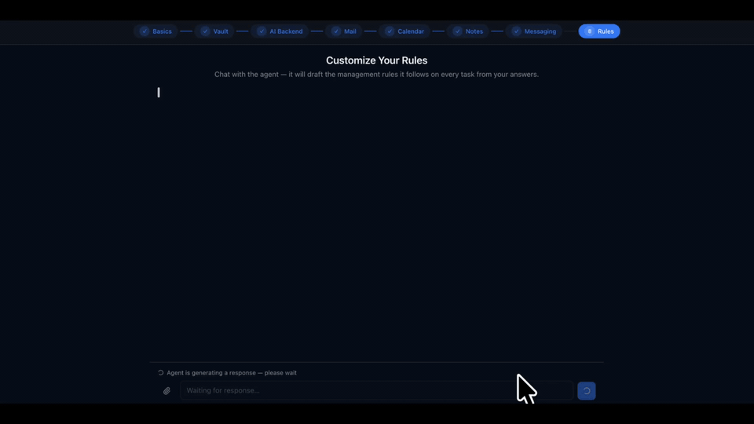
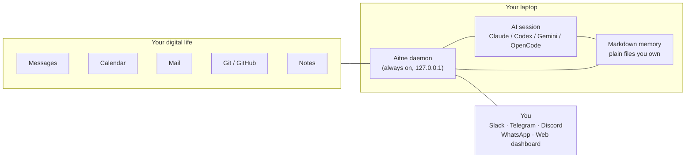

<div align="center">

# Aitne

[](https://www.npmjs.com/package/@aitne-sh/aitne)
[](./LICENSE)
[](https://nodejs.org)
[](#platform-support)

**Wake up to a brief that was written for you, by you.**

At 04:00, Aitne reads your calendar, mail, GitHub, and notes — then drafts a one-page plan for the day ahead: today's meetings, the email thread you missed, the PR your teammate is waiting on. Before you've finished coffee, the summary is in your DMs. By evening it journals what actually happened.

All on your laptop. All Markdown you own. Bring your own AI (Claude Code / Codex / Gemini CLI) — Aitne is the part that watches, schedules, and remembers.

```bash
npm install -g @aitne-sh/aitne@latest
aitne start
```



</div>

---

## A day with Aitne

Aitne is a daemon on your laptop, connected to your calendar, mail (Gmail / Outlook / iCloud / Yahoo), GitHub, Obsidian, and Notion. You talk to it through DMs in Slack / Telegram / Discord / WhatsApp — or through a local dashboard at `:8322`.

- **04:00 — Morning routine.** Aitne reads everything that landed overnight (mail, GitHub activity, calendar changes, vault updates) and writes `today.md` — sample below.
- **Morning — Brief.** The plan lands in your DMs as a short summary.
- **Through the day — Nudges.** Meeting reminders, periodic background checks (default: every 2 hours) for the things you care about (eval results, PR review requests, new mail). DMs only when there's something worth your attention.
- **Evening — Review.** Aitne writes a daily journal: what got done, what slipped, one observation about the week.

You steer it through natural-language DMs ("skip morning routine on Sundays", "ping me when the overnight job finishes") and bang commands (`!cost`, `!ask`, `!ingest`).

---

## Aitne's plan for today

`today.md` — written each morning into `~/.personal-agent/context/state/`. Plain Markdown you can `cat`, `vim`, or sync to Obsidian. Sample:

```text
2026-05-20 (Wednesday)
Day type: Weekday | Work focus: on | Study focus: on | Personal focus: on

User Schedule
 10:00 — Team standup (#ml-platform)
 13:30 — RAG eval review with research team
 16:00 — 1:1 with manager (quarterly check-in)
 21:00 — Overnight training window opens (8xH100 reserved)

User Tasks
 Land the embedding-index refactor PR — address review feedback [URGENT] [work]
 Cancel unused GPU reservation before 18:00 — billing cutoff [work]
 Skim 3 papers from yesterday's arxiv digest — pick one for Friday's reading group [study]
 Renew gym membership before Friday [personal]
 Reply to dentist about reschedule [personal]

Agent Plan
 09:45 Notify: standup in 15 min [work] →notify
 17:30 Notify: cancel GPU reservation by 18:00 to avoid overnight charges [work] →notify
 20:45 Notify: training window opens in 15 min — confirm dataset hash [work] →notify

Agent Notes
 (HIGH) 2026-05-22 (Fri): Reading group at 16:00 — pick paper by Thu evening
 (HIGH) 2026-05-23 (Sat): Friend's birthday dinner — gift not bought yet
 (MED)  2026-05-25 (Mon): Quarterly OKR review — draft self-assessment by EOD Sun
 Two coworkers pushed to feat/embedding-index since you last pulled [work]
 Overnight eval run finished — accuracy +1.2pp, p95 latency +18ms [work]
 Bank statement available — review when convenient [personal]
 Weather: rain 06:00–10:00 — leave 10 min earlier [personal]

Agent Log
 04:12 Morning Routine completed — today.md drafted from 23 raw signals
 07:02 Sent morning brief to Slack DM (4 priorities, 2 timing alerts)
 12:38 Activity scan: 1 new GitHub review request, 0 calendar changes
 18:00 Evening Review completed — 3 of 5 tasks closed; 2 carried to tomorrow

Handoff
 Tomorrow
  Reply to dentist about reschedule [personal]
  Pick reading-group paper [study]
  Triage overnight training-run metrics [work]
 Later
  2026-05-22 (Fri): Reading group at 16:00
  2026-05-23 (Sat): Friend's birthday dinner
  2026-05-25 (Mon): Quarterly OKR review
```

---

## Why Aitne

**You don't open it. It opens to you.**
Most AI tools wait for you to type. Aitne goes first — it watches all day and reaches out only when there's something worth acting on.

**Nothing leaves your laptop.**
The daemon binds to `127.0.0.1` only. Secrets sit in your OS keychain. Memory is plain Markdown under `~/.personal-agent/`. No vendor account, no remote sync, no telemetry — your AI provider's API is the only thing that talks to the network, on your own key.

**Bring your own model.**
Per-task routing assigns the right tier to the right backend, and the router fails over automatically on quota or auth issues. Run one backend or all of them — your choice.

**Memory compounds, the model doesn't have to.**
Every DM, every correction, every observation goes into your Markdown context. The model stays stateless — your story grows.

Already running Claude Code in a terminal? Aitne is the part that wakes itself up before you do, watches your mail and calendar between your sessions, remembers what you told it last week, and reaches you in your DMs without a terminal open.

---

## Is this for you?

**Aitne fits if you...**
- already use Claude Code, Codex CLI, or Gemini CLI daily
- want context that survives sessions, without uploading your life to someone's server
- are comfortable running a daemon on your laptop and pasting an API key

**You'll bounce off if you...**
- want a polished hosted chat UI — this isn't that
- don't have an API key for at least one provider (Aitne spawns sessions on your behalf; the cost lands on your account)
- expect zero setup — there's a 9-step wizard for integrations and channels

---

## Install

```bash
npm install -g @aitne-sh/aitne@latest
aitne start
```

The daemon listens on `:8321`, the dashboard on `:8322`. After `aitne start`, your browser opens to the setup wizard.

You also need at least one AI backend installed and one API key. The documented operating mode is **provider API keys** — paste them into the wizard (they land in the OS keychain, never `.env`):

| Backend | Install | Auth |
|---|---|---|
| **Claude Code** | `npm install -g @anthropic-ai/claude-code` | `ANTHROPIC_API_KEY` in the wizard (Anthropic's headless-agent policy disallows Pro/Max subscriptions for SDK sessions) |
| **OpenAI Codex CLI** | `npm install -g @openai/codex` | `OPENAI_API_KEY` in the wizard, or `codex login --device-auth` |
| **Google Gemini CLI** | `npm install -g @google/gemini-cli` | `GEMINI_API_KEY` / `GOOGLE_API_KEY`, or OAuth on first use |
| **OpenCode** (sst/opencode) | `npm install -g opencode-ai` | provider via `opencode auth login`, set in the wizard |

### Verify

```bash
aitne status   # PIDs, uptime, connected platforms, today's spend
aitne doctor   # install-health diagnostic (Node, ports, keychain, CLIs, native bindings)
aitne logs -f  # tail the daemon log
```

### From source

Contributors and anyone hacking on the daemon directly. Requires Node ≥ 22 and pnpm 10.x.

```bash
git clone https://github.com/Aitne-sh/Aitne.git aitne
cd aitne
corepack enable
pnpm install
pnpm dev          # foreground mode with full stdio
```

Full walkthrough: [docs/setup-guide.md](docs/setup-guide.md).

---

## How it works

A long-running daemon receives signals from every channel you've connected, parks short-term state in SQLite, and spawns an AI session whenever it needs to think. The session reads your Markdown memory, calls a curated set of skills, and writes results back through the daemon API.



Two execution paths run in parallel:

- **Reactive path** — owner DMs/mentions, cron routines (morning / evening / weekly), calendar approach events. Event → priority heap → dispatcher → backend session.
- **Polling path** — observers for Git, GitHub, Obsidian, Notion, Calendar, Mail write to an `observations` table without spawning sessions. A periodic cron (the activity scan, default every 2 hours) triages those observations through a lite-tier session, then escalates to a full Sonnet-class session only if something is worth surfacing.

A pre-pass `routine.fetch_window` session runs before each routine, fanning out per-account fetches (mail, calendar, Notion) into the `observations` table so the main session reads from a single source.

---

## Backends

Aitne abstracts four AI runtimes behind one `IAgentCore` interface. Every kind of work has a `ProcessKey` mapped to a tier (`lite` / `medium` / `high`) and a backend; for Claude those tiers map to **Haiku 4.5 / Sonnet 4.6 / Opus 4.8**. The high tier is opt-in — no install-time surface defaults to it; pin it per row from `:8322/settings/models`.

| Backend | Implementation | Resume | Strengths |
|---|---|---|---|
| **Claude Code** | `@anthropic-ai/claude-agent-sdk` | ✓ | Routines, deep context, server-side advisor |
| **Codex CLI** | OpenAI Codex CLI subprocess + JSONL stream | ✓ | Code-heavy tasks, fast iteration |
| **Gemini CLI** | Google Gemini CLI subprocess + JSONL stream | ✓ | Free-tier headroom, large-context summarization |
| **OpenCode** | `opencode-ai` HTTP server + SDK client | ✓ | Multi-provider — routes to any `opencode auth login` provider |

The router fails over to a configured fallback automatically on `BackendQuotaError` or decisive failure, re-materializing the fallback's instruction file and skill directories into the session workdir. Per-process tier defaults and routing are editable at `:8322/settings/models`.

---

## Integrations

| Category | Providers |
|---|---|
| **Messaging** | Slack (Socket Mode), Telegram, Discord, WhatsApp (Baileys), Web dashboard |
| **Mail** | Gmail, Outlook, Yahoo, iCloud — unified API, classifier, local FTS5 search, IMAP IDLE |
| **Calendar** | Google Calendar, Outlook Calendar, iCloud (CalDAV) — free/busy slot-finding across accounts |
| **Knowledge** | Obsidian (CLI + vault watch), Notion (REST), custom MCP servers |
| **Code** | Local Git, GitHub (Octokit + webhooks) |
| **Lifestyle** | Auto-extracted receipts · travel bookings · Kindle highlights · browser-history research clusters · voice transcription (Whisper, opt-in) |

Each integration runs in one of four modes:

| Mode | Auth held by | Polling? | Capabilities |
|---|---|---|---|
| **`direct`** | Daemon (OAuth in OS Keychain) | Daemon poller | Full feature set |
| **`delegated`** | Main backend's connector | Cron worker (per-cadence opt-in) | Whatever the connector exposes |
| **`native`** | Main backend's connector | None — reached in-turn via MCP | On-demand only |
| **`disabled`** | — | — | Off |

Every mode change goes through a live capability probe and a per-key flip lock.

---

## What you can do

<details open>
<summary><b>Time, calendar, travel</b></summary>

- Auto-generate `today.md` every morning with your real schedule
- 15-min approach reminders for every event
- Find a 30-min slot across multiple calendars — Aitne checks freebusy and replies with options
- Auto-extract flight, hotel, train confirmations from email into a structured travel timeline
</details>

<details open>
<summary><b>Mail across every account</b></summary>

- Unified inbox across Gmail, Outlook, Yahoo, and iCloud (OAuth or app-password / IMAP)
- Local FTS5 full-text search across every account
- Auto-classify, label, archive, and draft replies in your style
- Forwarded receipts auto-extract into a structured receipts table
- IMAP IDLE for near-real-time delivery; PDF/image attachments are extracted and indexed
</details>

<details open>
<summary><b>Agents you can define and schedule</b></summary>

- Every routine is a first-class **Agent** — an identity with a YAML config + Markdown brief, editable at `:8322/agents`
- The built-in routines (morning routine, evening review, activity scan, …) ship as **System** agents — can't be deleted, but can be stopped with a warning
- Define your own recurring **work** agents (daily / weekly / monthly) — from the dashboard form or just by DMing the agent ("summarize my open PRs every Monday at 9")
- Pin a backend, model, and tier per agent; see per-agent cost, success rate, and run history; fire any agent on demand
- One-shot wake-ups ("remind me at 3pm"), pre-composed scheduled DMs, and recurring briefings — all quiet-hours-aware
</details>

<details>
<summary><b>Browser automation (managed Chromium)</b></summary>

- DM an open-ended browser task ("check my order status", "fill out this form") — a scoped sub-agent drives a managed Chromium session turn-by-turn, asking you to clarify mid-task and DMing back results + screenshots
- Egress guards stay on: RFC1918 / loopback / cloud-metadata IP blocking, a form-submit payment-path blocker, and single-owner scoping
- Purchase confirmation (the B-4 flow — DM-delivered single-use token + screenshot-first consent) is **experimental and default-off**; it requires explicit per-site dashboard opt-in
</details>

<details>
<summary><b>Knowledge: Obsidian, Notion, your own wiki</b></summary>

- Use your existing Obsidian vault as Aitne's primary memory store — wiki-links keep working
- Append to your daily note via the official Obsidian CLI
- Full Notion page and database CRUD
- DM `!ingest <url>` to capture a source, `!compile` to synthesize raw notes into linked wiki articles
- `!ask <question>` answers from your own wiki and writes the cited reply to `30_outputs/`
- `!lint`, `!trace`, `!connect` for vault health, idea evolution, cross-domain bridges
- Multiple workspaces (`!ingest @research ...`) — internal or any number of external Obsidian vaults
</details>

<details>
<summary><b>Code, Git, GitHub</b></summary>

- Local Git: `git log`, `git diff`, `git show` exposed via daemon proxy
- GitHub: PR lists, comments, issues, webhook receivers (HMAC-SHA256 verified)
- Per-repo cron triggers — "every Monday at 09:00, summarize merged PRs into the repo's daily journal"
- Auto-detect when a coworker modified a file you're about to ship
- Unified Repositories: one row pairs a local clone with a GitHub remote; the doctor flags drift
</details>

<details>
<summary><b>Self-management via natural language</b></summary>

- "Don't run activity scans on weekends" — patches the cron window
- "Remember my partner's birthday is March 14" — appends to `identity/profile.md`
- "I prefer concise replies — no preamble" — updates the agent's `character` field
- "Email me a summary every Friday at 5pm" — creates a recurring schedule
- "Switch to Codex for code reviews" — flips the per-process backend mapping
- Bang commands for instant control: `!stop` / `!start` (pause/resume autonomous work), `!close` (reset the DM session), `!cost`, `!report`, `!help` — and define your own `!commands` at `:8322/settings/commands`
- Every change is journaled to `agent_actions` — audit anything via `aitne audit`
</details>

<details>
<summary><b>Bring your own toolkit</b></summary>

- Your `~/.claude/skills`, `~/.codex/config.toml`, and `~/.gemini/` settings are loaded on session init
- Custom MCP servers materialize into every per-session workdir
- Aitne layers its persona on top of your existing config — nothing gets overwritten
- Voice attachments — opt-in local Whisper transcription via `ffmpeg-static` + `@huggingface/transformers`
</details>

---

## Memory

Everything Aitne writes lives in `~/.personal-agent/context/`:

```
context/
├── state/
│   ├── today.md            # Working view, always injected
│   ├── yesterday.md        # Daemon-rotated archive
│   ├── inbox/              # Captured snippets
│   └── scratch/            # Short-lived agent notes (48h TTL)
├── plans/
│   ├── roadmap.md          # Long-term goals
│   └── projects/           # One file per active project
├── identity/              # profile.md, people.md, work.md, …
├── policies/              # Management rules, MCP config, redaction, routines
├── journal/
│   ├── daily/YYYY-MM-DD.md # Synthesized daily journal
│   ├── weekly/            # Weekly retrospectives
│   └── agent.md           # Private agent self-reflection
└── knowledge/             # wiki, per-repo overviews, entities, dossiers
```

Context writes flow through `curl http://localhost:8321/api/context/<class>/<path>` — where `<class>` is one of `identity`, `state`, `plans`, `journal`, `knowledge`, `policies` — not the SDK's `Edit`/`Write` tools. This gives the daemon a single chokepoint for write locks, frontmatter validation, and 30-day snapshots. SQLite (`better-sqlite3` with FTS5) backs sessions, observations, agent actions, and history.

Schema upgrades are forward-only and idempotent — the migration runner preserves your SQLite history and Markdown context across releases. (`aitne update` prints the `npm install -g @aitne-sh/aitne@latest` command; there is no self-updater.)

---

## Safety

Four independent layers, designed so the bottom layer holds even when upper layers are widened:

1. **SDK permission model** — strict `allowedTools` whitelist in Safe mode; `bypassPermissions` in Allow mode
2. **PreToolUse hooks** (Claude, Safe mode) — `curl` parsed for hostname + port; daemon-API is the only legal write path
3. **Daemon API risk tiers** — `Autonomous` / `ReadSensitive` (X-Read-Token) / `Approve` (Bearer token)
4. **Absolute-block layer** — recursive deletes, `sudo`, pipe-to-shell, secret-file reads/writes, Anthropic-cloud managed-agent tools — hard-denied in **both** modes regardless of overrides

Plus: localhost-only API, webhook HMAC verification, no automated financial transactions, no automated social posting, single-owner adapter filtering, periodic auth-health monitoring with auto-recovery.

---

## Cost

| Control | Default | Effect when set |
|---|---|---|
| `maxConcurrentSessions` (autonomous) | 3 | Hard semaphore |
| `maxReactiveSessions` (DMs) | 2 | Hard semaphore |
| `executeTimeoutMinutes` | 60 | Per-execute watchdog |
| `autonomousDailyCostCapUsd` | `null` | Priority-based skipping: `activity_scan` at 100%, `roadmap_refresh` at 120%, `evening_review` at 150%, `morning_routine` at 200%. Reactive DMs are not gated. |
| `autonomousMonthlyCostCapUsd` | `null` | Alert + warn surface |
| Per-ProcessKey `maxBudgetUsd` | per-row | Hard cap per execute |

Typical day for an active user: **~$0.50** (morning routine + briefing + 2× activity scan + 1 DM + evening review, all on Sonnet 4.6). Quota exhaustion is detected, dedupe-notified once per 2-hour window, and retried on the next tick.

---

## Operating Aitne

### Dashboard

The dashboard at `:8322` is a full local app, not just a settings panel:

- **`/chat`** — talk to any backend/model right in the browser, with per-session overrides
- **`/agents`** — define, schedule, and inspect your agents (above)
- **`/schedule`** + **`/activity`** — upcoming runs and the full conversation/action history
- **`/analytics`** + **`/health`** — cost/usage trends and integration-mode health
- **`/connections/*`** — wire up calendar, mail, repositories, messaging, MCP, routines
- **`/settings/*`** — `models`, `backends`, `schedule`, `routines`, `processes`, `messaging`, `commands` (custom bang commands), `management`, and the experimental browser-history surfaces

### Lifecycle

| Command | What it does |
|---|---|
| `aitne start [--no-open]` | Build if stale, launch daemon + dashboard in background |
| `aitne stop` | Graceful shutdown (SIGTERM → SIGKILL after 10 s) |
| `aitne restart [--clean-context]` | Stop then start. `--clean-context` wipes `context/` after a tarball backup |
| `aitne status` | PIDs, uptime, platforms, backends, today's spend |
| `aitne logs [-f] [-n N] [-d]` | Tail daemon log (`-d` = dashboard, `-f` = follow) |
| `aitne dev` | Foreground mode (full stdio) |

### Operations

| Command | What it does |
|---|---|
| `aitne doctor [--json]` | Eight install-health checks + per-repo GitHub-link drift expansion |
| `aitne audit [flags]` | Read the agent action log — `--since`, `--type`, `--result`, `--backend`, `--detail`, `--json` |
| `aitne setup` | Re-open the `/setup` wizard |
| `aitne open` | Open the dashboard in your browser |
| `aitne run-now <job>` | Fire a maintenance job on demand (currently `roadmap_maintenance`) |
| `aitne verify <target>` | Read-only post-launch verification of a shipped design surface |
| `aitne version` / `update` / `uninstall` | Self-explanatory |

`aitne help [cmd]` for per-command details.

### Configuration

`.env` is **bootstrap-only** (`PA_DATA_DIR`, `PA_API_PORT`, `PA_DASHBOARD_PORT`, `PA_LOG_LEVEL`). Everything else — ~130 runtime keys covering schedule, notifications, models, character, mail, voice, delegated mode — is editable from the dashboard at `:8322`, or via natural-language DMs to the agent.

---

## Platform support

| | macOS | Linux | Windows |
|---|---|---|---|
| **Secret storage** | Keychain | `secret-tool` (libsecret) → AES file fallback | DPAPI → AES file fallback |
| **Folder picker** | `osascript` | `zenity` / `kdialog` / `yad` | `FolderBrowserDialog` |
| **Process tree kill** | POSIX process group | POSIX process group | `taskkill /T /F` |

WSL falls back to the encrypted file store — set `PA_MASTER_PASSWORD` to a long random string. Windows users hitting `ENAMETOOLONG` on install should enable long paths via the `LongPathsEnabled=1` registry key.

Common gotchas: [docs/troubleshooting.md](docs/troubleshooting.md).

---

## Documentation

| Topic | Doc |
|---|---|
| Documentation index | [docs/index.md](docs/index.md) |
| Setup walkthrough | [docs/setup-guide.md](docs/setup-guide.md) |
| Troubleshooting | [docs/troubleshooting.md](docs/troubleshooting.md) |
| Maintenance playbook | [docs/maintenance.md](docs/maintenance.md) |
| Advisor model | [docs/advisor.md](docs/advisor.md) |

---

## Tech stack

Daemon: Node.js 22 · Hono · `@anthropic-ai/claude-agent-sdk` · `@slack/bolt` · `telegraf` · `discord.js` · `@whiskeysockets/baileys` · `googleapis` · `@azure/msal-node` · `@notionhq/client` · `@octokit/rest` · `tsdav` · `chokidar` · `node-cron` · `better-sqlite3` (FTS5) · `pino` · `zod`

Dashboard: Next.js 16 · React 19 · Tailwind 4 · shadcn/ui · TanStack Query · Recharts · Monaco

Monorepo: pnpm 10 workspaces · Turborepo · TypeScript 5.8 · Vitest 3 (100% coverage gate on a curated pure-logic subset)

---

## License

MIT — see [LICENSE](./LICENSE).
